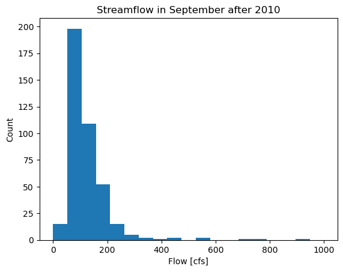
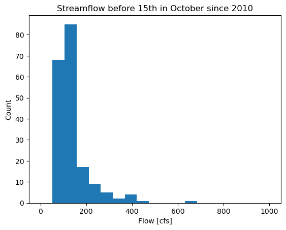

#### Name: Tong Guo
#### Date: 09/25/2023
#### Assignment_5

### Grade
3/3 Nice job!
- note I made some changes to your markdown formatting you don't need to have the '>' at the start of every line and you don't need to have ### before all you paragraphs. See below I just simplified it a bit for you. 
- This was a really hard assignment this week and a lot of people struggled. You made it really far!
  
###

### Forecast:
- **one week: 97.67 cfs**
- **two week: 115 cfs**
#### Reason: 
According to the quantiles of the flow in September after 2010, the results shows that there are 50% flow are less than 103 cfs, and the average flow is 127.35 cfs, the plot also shows that the number of flow from 50 to 100 counts most. The average flow for September 2023 is 92.89 cfs, which means the flow in this September might not greater than 100 cfs.Therefore the one week forecast should be less than 100 cfs, my forecasting is 97.67 cfs.

And for the two week forecast is the flow in October, I also calculate the quantiles of flow in the first half of October after 2010, the results show that 50% of the flow is less than 123 cfs and the average flow is 156.16 cfs. The figure indicates the flow from 100 to 150 counts most in October, which means the flow in October increases than in September significantly, so the two week forecast is 115 cfs.
> 
>
### Assignment Questions
- The dimension of flow_5yr is **2**.
The average flow of the five years is **325.1862541073384 cfs**.

- The fisrt five days values are:**19353600. 19008000. 18748800. 18316800. 18316800.**
The entire time period is **51303464640.0 cubic feet**.

- [2.01500000e+03 1.00000000e+00 3.03451613e+02]
 [2.01500000e+03 2.00000000e+00 4.29500000e+02]
 [2.01500000e+03 3.00000000e+00 1.41806452e+03]
 [2.01500000e+03 4.00000000e+00 9.86966667e+01]
 [2.01500000e+03 5.00000000e+00 1.21548387e+02]

### Reflection: 
In class, I thought I can understand the for loop exercise, but when doing the assignment, it's kind of frustrating that it seems I cannot apply well for loop into my python homework. And sometimes using np is much easier than using loop.

The `flow_monthly` is a little bit hard at first, because the python script you taught us in class didn't work on my computer...so I tried to spend time rewriting it and I think I can know the logic of how to build this array! 