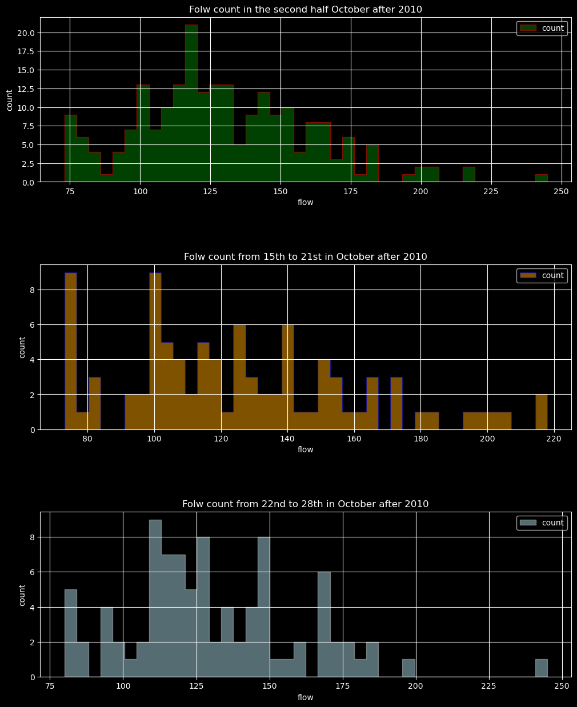
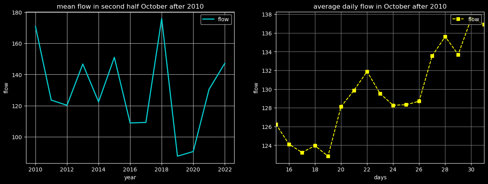
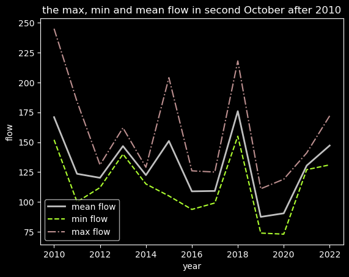
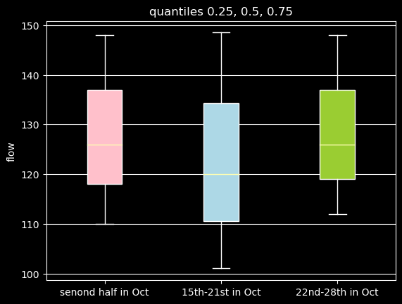
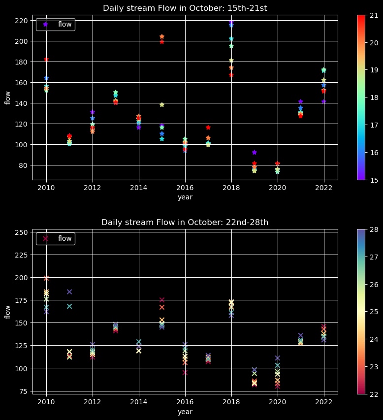

#### Name: Tong Guo
#### Date: 10/16/2023
#### Assignment_7

### Forecast:
| Forecast | Flow(cfs) |
| ----------- | ----------- |
| **one week** | **89.325** |
| **two week** | **101.44** |
#### Reason: 

 ### Assignment Questions:
1. **Summarize your forecast and for the week and how you came up with it.**
   
I picked up the flow data the `month` is October and `year` larger 2010, `day` greater 15 and group the data by `year` as my firstweek forecast, then I calculated the mean, max and min flow, from the results I found that the minimun flow of October is in 2023, and the mean flow of October in 2023 also has the lowest flow, which means in 2023 the flow might not decrease than the previous years.

In the second left plot, we can see that the flow fluctuates from year to year, the flow is one year high and the next one or two year is low. Combined with the above information, the flow in October 2023 should be reduced.

In the plot of daily flow in October after 2010, the plot shows that in most years, the flow in 21st was lower than 15st, or the flow values are pretty close to each other, based on the available data for October 2023, the flow data also close, therefore the data in 2016, 2017, 2019 and 2020 have reference value.
And the flow increase in 22nd to 28st compare with 15th to 21st.

Therefore, the one and two week forecast is the mean flow for the same period in 2016, 2017, 2019 and 2020.    

1. **Create 5 plots that summarize the streamflow data and help you make your forecast. For each of your plots copy the image into your markdown and include a sentence describing the plot and explaining why you chose to plot what you did.**

- This the plot decribes the flow count in the second half of October, dates from 15th to 21st and from 22nd to 28th in October after 2010, respectively. 

- The left plot is the mean flow in second half of October after 2010, the right figure is about the average daily flow from second half in October after 2010.

- The third plot is the average, minimun and maximun flow in second half in October after 2010. 

- The forth plot is a boxplot that decribes the quantiles 0.25, 0.5 and 0.75. The pink box represent the second half of October, the bule and green boxes represent the dates from 15th to 21st and 22nd to 28th in October after 2010.

- The fifth plot is a scatter plot that we can know the daily flow (the date of upper plot is from 15th to 21st and the bottom is from 22nd to 28th) in different year(2010-2022).

3. **Write a short reflection on your progress so far:**

I feel much better in pandas and matplot, pandas is much easier than numpy, even I met the problem it can be solved much faster.

I think I can figure out the problems I met in pandas or matplot by googling but it might take a while, and I am really satisfied that I can plot the fifth figure because I modified the code from the exercise we did in the class :-)                                                      

             

