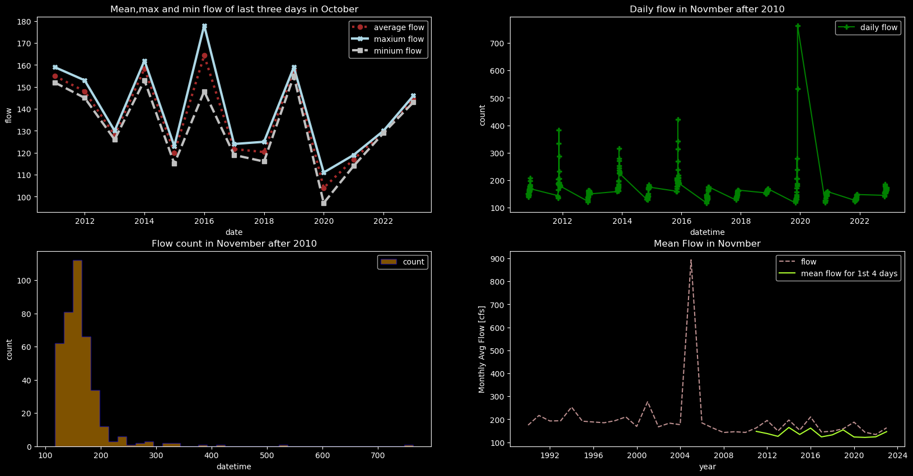
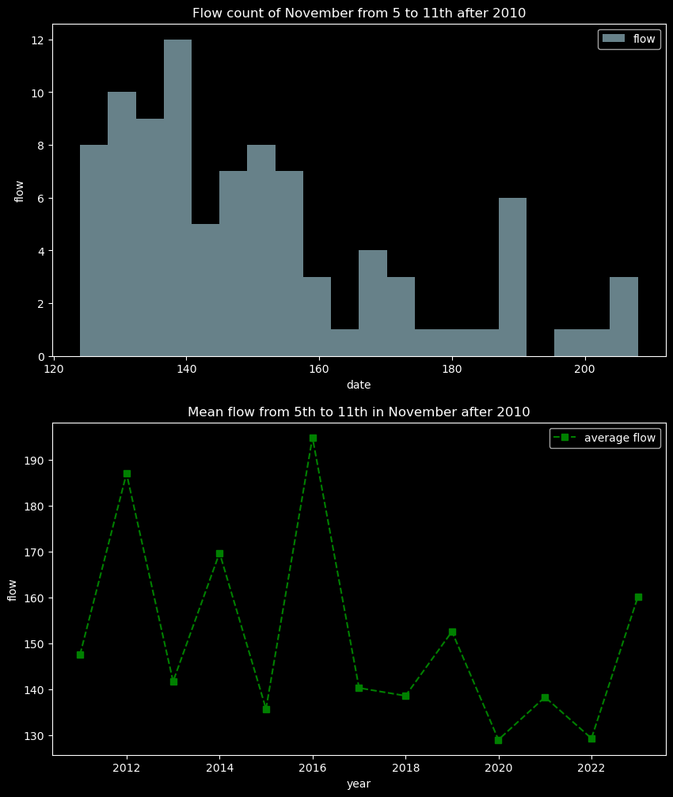
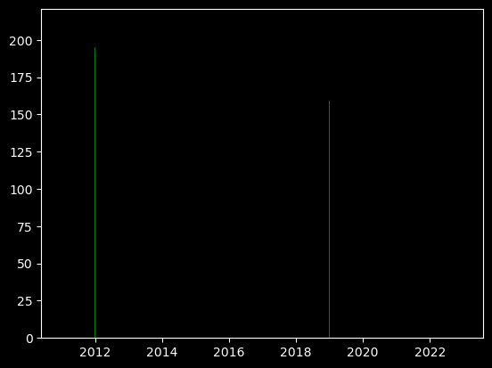

#### Name: Tong Guo
#### Date: 10/29/2023
#### Assignment_9

### Grade 7.5/9
**Code Review**
- I left comments in your code with some suggestions they all start with #LC
Readability: 2.5/3 
    -  You did not have very many comments at all in your code which made it hard to follow. I left suggestions for you on ones you can add. 
    -  Most of your variable names were good but some could be more descriptive and I left you comments for those. 
Style: 2.5/3
    - I left a bunch of comments for you on adding more white space and formatting lines of code that go onto multiple lines this will make it much easier to read. 
    - Also note there were a bunch of spacing issues that the linter found that were not addressed so make sure to go through and catch those. 
Code:  2.5/3
    - Your code ran perfectly and I didn't have any issues. 
    - Also your plots are beautiful! Really love them. 
    - I subtracted 0.5 because you don't have a function in your code and that was a requirement. 

### Forecast:
| Forecast | Flow(cfs) |
| ----------- | ----------- |
| **one week** | **116.72** |
| **two week** | **135.09** |

1. **How you generated your forecast**

 For the one week forecast, the date includes the last three days of October and the first four days of November, so I calculate the mean value of the last days in October and according to the trend of the recent 13 years (year after 2010), and this year the flow should decrease, so I choose the mean flow of 2019 and 2020 as the October flow. The figure of the flow in November seems to fluctuate around 200 cfs over the years except 2004, and the flow for the first 4 days in November also fluctuate around 150 cfs, and still this should have a lower flow so calculating the mean flow in 2019, 2020 and 2021, combined with the data in October and November and the mean value is the result of the one week forecast.
 
 For the two week forecast, from the figure of the mean flow of 5 to 11th over the years after 2010, the flow of this year should be a low flow year, I calculate the mean value of 2016 to 2021 but exclude 2018 due to the high value and the result is consist with the flow count of November from 5 to 11th after 2010 which the flow less than 140 counts has a large percentage.

1. **How you made your script better this week**

By renaming the variable in my script (but the name is really long) and adding the comments.

3. **What you chose to put in a function and why**

I put the mean function in my script which you can get the mean flow of any month in any year because it is useful to know the flow change over the month and can help us to predict the flow in the specific month.

1. **Remaining questions you have or thing you think could be better about your script but you don't know how.**

I tried to plot a bar figure about the mean flow of every year but I don't know why the reslut only shows two bars (the code below) so how can I draw the bar plot when using the timeseries? 

`fig, ax =plt.subplots()
ax.bar(Nov_mean_flow_after_2010_yearly.index, Nov_mean_flow_after_2010_yearly.values,
       color='green')`
