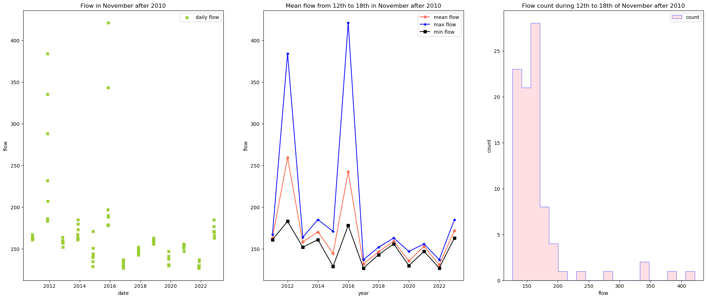

#### Name: Tong Guo
#### Date: 11/06/2023
#### Assignment_10

### Forecast:
| Forecast | Flow(cfs) |
| ----------- | ----------- |
| **one week** | **132.19** |
| **two week** | **142.86** |

1. **How you generated your forecast**

 For the one week forecast, I calculate the mean value of from 5th to 11th in November and according to the trend of the recent 13 years (year after 2010), the flow of this year should decrease, so I choose the mean flow of 2019, 2020 and 2021 which are the 'low' flow year as the the result of the one week forecast.
 
 For the two week forecast, from the figure of the mean flow of 12 to 18th over the years after 2010, the flow of this year should be a low flow year, I calculate the mean value of 2016 to 2021 during the same period that thoes years have regular flow ups and downs.

1. **Write a short markdown reflecting on (1) What you learned, (2) things you still find confusing or couldn't solve.**

The for loop, in Tuesday class I think I know how to write the exercise about the for loop, but I got stuck on how to let `i` loop the right times, in class you use `array.shape[1]` which can get the number of column, but I think if we finish for loop by myself I might spend sometime to figure out it. And I didn't realize that I also need to build an array to put the results. And in practice, do we use for loop a lot?
But I feel quite confident in pandas exercise...! Most exercise I can finish and I think the exercises are not difficult for me.